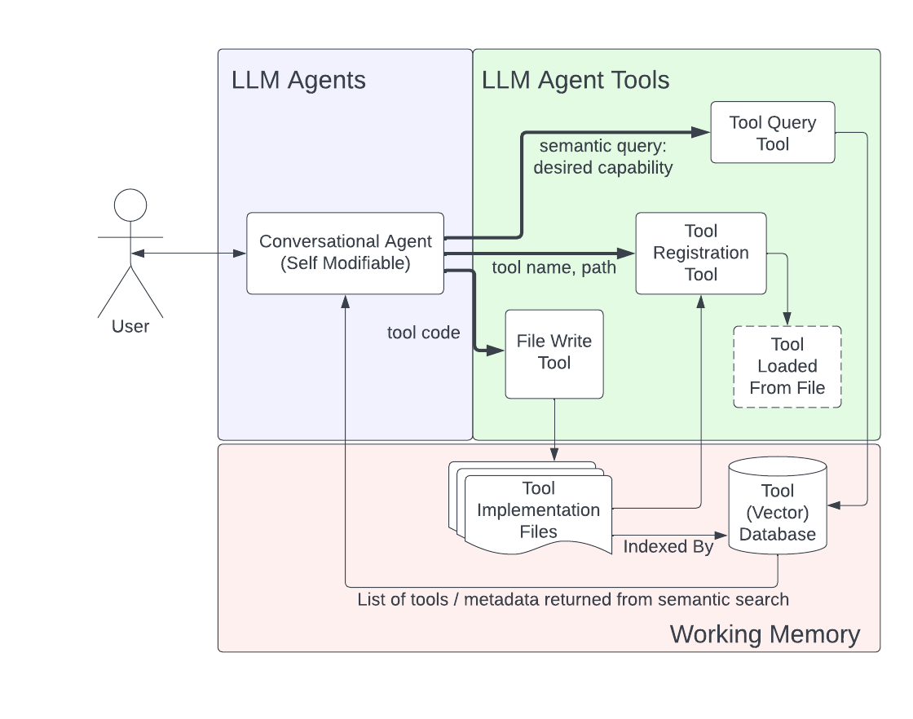

# LLM Auto Forge

Welcome to the **LLM Auto Forge** project! An initiative aiming to advance the boundaries of LangChain task-driven agents. Dive into the dynamic world where agents evolve, create, and self-improve.

At its heart, **LLM Auto Forge** teaches LangChain agents to "extend capabilities on-the-fly". It's about dynamic evolution to transcend inherent limitations. While such systems (including this one) can prove to be unpredicable and/or rough around the edges, I believe there is much promise to be found in this approach. and the shape of things to come will be paved by a combination of generative AI advancements paired with the systems engineering necessary to create cognitive architectures capable of leveraging them to their fullest potential.


Haephestia - The mascot of LLM Auto Forge. Generated using Stable Diffusion on my PC, SDXL 1.0 with Variational Autoencoder. According to current copyright law, this image is in the public domain.

## Table of Contents

- [Project Purpose and Significance](#project-purpose-and-significance)
- [Comparative Landscape](#comparative-landscape)
- [Key Features](#key-features)
  - [Tool Registration Capability](#tool-registration-capability)
  - [Vector Store Backed Tool](#vector-store-backed-tool)
- [Main Components](#main-components)
  - [Agents.py](#agentspy)
  - [tools Directory](#tools-directory)
- [A Simple Example](#a-simple-example)
- [A More Complex Example](#a-more-complex-example)
- [Future Work](#future-work)
    - [Tool Servers and Exchanges](#tool-servers-and-exchanges)
    - [Tool Utility Scoring](#tool-utility-scoring)
    - [Curated Tool Suites](#curated-tool-suites)
- [Disclaimers and Safety Warnings](#disclaimers-and-safety-warnings)
- [License](#license)
- [Contact](#contact)
- [Contributions](#contributions)
## Project Purpose and Significance

**LLM Auto Forge** propels LangChain task-driven agents to:
- **Recognize and Overcome Limitations**: Autonomously identify constraints and deploy tools to navigate them.
- **Dynamically Craft Tools**: Design solutions instantly upon encountering unsolvable problems.
- **Use, Store, and Retrieve Tools**: It's not just about creation; it's about effective utility and recall.

It is my hope that the development of these sorts of capabilities, my others and myself, herald a new era of AI, driving us towards an evolutionary, adaptive paradigm.

### Comparative Landscape

As of 8/1/2023, a team from **Google DeepMind** and **Princeton** showcased a similar project, [LLM-ToolMaker](https://github.com/ctlllll/LLM-ToolMaker). They too delved into LLMs designing their tools within a closed-loop framework.

While their initiative had some similarities, **LLM Auto Forge** diverges with a focus on providing tangible solutions to real-world challenges, leveraging the immense potential of the internet.

For context:

> **LLM-ToolMaker**:
> - **Motivation**: Enhancing LLMs' problem-solving through external tools.
> - **Overview**: Two phases: Tool-making and Tool-using. Crafting Python utility functions and utilizing them for varied future tasks.

[HuggingGPT](https://arxiv.org/abs/2303.17580) further laid the groundwork for combining linguistic and AI capabilities to tackle intricate AI tasks.

That being said, there are likely countless others who are making contributions in this space. I encourage you to explore and share your findings.
### Further Inspiration

YouTuber and Author David Shapiro's take on [Polymorphic Applications](https://www.youtube.com/watch?v=Y1gBosXlM8c) inspired and resonated with this vision, emphasizing cognitive architectures and system-centric strategies.

## Key Features




### Tool Registration Capability

Post-creation, agents can rapidly integrate and deploy tools, streamlining problem resolution.

### Vector Store Backed Tool

To prevent redundancy, a vector store of agent-crafted tools aids agents in quickly searching and utilizing pre-existing tools for immediate challenges.

## Main Components

### Agents.py

This file contains several classes that define the agents in the project.

- `DialogueAgent`: A basic chat agent that can send and receive messages.
- `SelfModifiableAgentExecutor`: An executor for agents that can modify themselves, by allowing the agent to use the ToolRegistry instead of a static list of tools.
- `DialogueAgentWithTools`: A dialogue agent that has a list of tools, and it seems to be able to use these tools to generate responses.
- `UserAgent`: A dialogue agent that takes user input as messages.

### Tools Directory

This directory contains several Python files that define the tools used in the project.

- `ToolQueryTool.py`: Defines a tool that allows an agent to query for available (unregistered) tools given a desired functional description and the agent's name. This is backed by a vector store of tools that have been created by other agents.
- `ToolRegistrationTool.py`: Defines a tool that allows an agent to load a tool for its own use given the tool name, tool filename (just the file name, no directory), and the agent's name. It also defines a tool that allows an agent to query the available python modules on the system.
- `ToolRegistry.py`: Defines a 'ToolRegistry' class that manages the tools available to each agent. It has methods for setting, getting, and adding tools for an agent. It also has methods for querying unregistered tools by their description and registering a tool.
- `LLMBrowsingTools.py`: Defines a 'WebScrapingCache' class that manages the scraping and caching of websites into a chroma vector database. It has methods for adding documents to the cache, querying a website, reading a specific page of a website, and scraping a website. The 'query_website' tool allows an agent to query a website for a specific piece of information, and the 'paged_web_browser' tool allows an agent to read a specific page of a website.
- `ToolTemplate.py`: Provides a template for creating new tools. Each tool is a function decorated with the '@tool' decorator and has a unique name. The function takes in some input parameters and returns a string. The function should handle any exceptions and return an error message if an exception occurs. The function should also have a docstring that provides a description of the tool.

For requirements, please refer to the requirements.txt file and the secrets.json.template file for the required API keys.

## A Simple Example

LLM Auto Forge, as illustrated by the provided code snippet, is a system for automating tasks and generating tools based on directives. The system integrates with the OpenAI model, incorporates file management utilities, and various predefined tools.

### 1. **Initialization and Setup**

#### Load Essential Modules

```python
from langchain import WikipediaAPIWrapper
from langchain.callbacks import StreamingStdOutCallbackHandler
from langchain.chat_models import ChatOpenAI
from langchain.tools import DuckDuckGoSearchRun, WikipediaQueryRun
from langchain.tools.file_management import WriteFileTool, ReadFileTool
from tools.ToolRegistrationTool import tool_registration_tool
from tools.ToolQueryTool import tool_query_tool
```

#### Set Up Secrets

```python
import util
util.load_secrets()
```

### 2. **Define System Prompts and Tools**

Assign predefined prompts to the system.

```python
system_prompt_scribe = TOOL_MAKER_PROMPT
```

List of tools that the system can use:

```python
tools = [
    ReadFileTool(),
    WriteFileTool(),
    WikipediaQueryRun(api_wrapper=WikipediaAPIWrapper()),
    DuckDuckGoSearchRun(),
    tool_registration_tool,
    tool_query_tool
]
```

### 3. **Initialize the Dialogue Agent**

Initialize a dialogue agent with specific attributes:

- Agent's name: "ToolMaker"
- System message
- The model for the agent: GPT-4 with specific parameters.
- A set of tools the agent can use.

```python
tool_making_agent = DialogueAgentWithTools(
    name="ToolMaker",
    system_message=system_prompt_scribe,
    model=ChatOpenAI(
        model_name='gpt-4',
        streaming=True,
        temperature=0.9,
        callbacks=[StreamingStdOutCallbackHandler()]
    ),
    tools=tools
)
```

### 4. **Interact with the Agent**

Send a request to the agent:

```python
tool_making_agent.receive("HumanUser", "Write the first sentence of the gettysburg address to a file (create a tool to do this).")
```

Let the agent process the request and send its response:

```python
tool_making_agent.send()
```

### 5. **Expected Output**

Upon receiving the request, the agent will:

1. Evaluate if a tool with the described functionality already exists.
2. If not, the agent will refer to a template for creating tools and then structure a new tool.
3. After creating the tool's pseudocode, it will attempt to write this tool to a specified directory.
4. Finally, upon successful execution, a message will be displayed indicating that the task has been completed.


> **Note:** While the process described above generally works as expected, it's important to be aware that sometimes these systems may act less predictably. Various factors, such as changes in underlying libraries, updates to the models, or the complexity of the input, can influence the behavior of the system. Always consider these factors when working with automated tool generation and be prepared to handle unexpected outcomes.

## A More Complex Example

In this section, we'll illustrate a more involved process where a conversational AI system is tasked with adding a caption directly into an image, based on its recognition of that image's contents.


### Given Instructions:

The agent is provided with the following set of tools and an initial request:
```
tools = [GoogleSearchTool,
         tool_query_tool,
         tool_registration_tool,
         query_available_modules,
         paged_web_browser,
         ] + file_tools

tool_making_agent = DialogueAgentWithTools(
    name="ToolMaker",
    system_message=system_prompt_scribe,
    model=ChatOpenAI(
        model_name='gpt-4',
        streaming=True,
        temperature=0.0,
        callbacks=[StreamingStdOutCallbackHandler()]),
    tools=tools)

tool_making_agent.receive("HumanUser", "Can you tell me what is in this image and add an in-picture caption to this "
                                       "image? ./TestInput/mystery_image.jpg Write the captioned image to "
                                       "./TestOutput/captioned_image.jpg")
```

The following section is a play-by-play of the agent's thought process and actions as it attempts to complete the task. This can be followed in the `ExampleOutput/ImageCaptioningExample.txt` file.
### Output Play-By-Play:

**System**: 
> Entering new SelfModifiableAgentExecutor chain...

**Thought**: 
The user wants me to identify what's in an image and add a caption to it. I need to check if I have a tool that can perform image recognition and add captions to images. 

**Action**:
```
{
  "action": "tool_query_tool",
  "action_input": {
    "tool_description": "image recognition",
    "agent_name": "ToolMaker"
  }
}
```
The system discovers some potentially useful tools and contemplates their capabilities.

**Observation**: 
Unregistered tools that might be relevant include a tool that performs a Google Image Search and another that displays an image from a given local file path.

**Thought**: 
The tools available for image recognition aren't exactly right for this job. A new tool needs to be designed and written.

After examining an example tool template (`ToolTemplate.py`), the system decides to write a new tool, `ImageRecognitionAndCaptioning.py`, to recognize and caption images. This tool would use the Huggingface Transformers library for image recognition and the PIL library for image modification.

**Action**: 
The system writes this new tool to `./AgentTools/ImageRecognitionAndCaptioning.py`.

**Observation**: 
The file is successfully created.

**Thought**: 
Now, this newly created tool must be registered for use.

**Action**: 
The system attempts to register the tool.

**Observation**: 
The tool registration is successful.

**Thought**: 
Now that the tool is ready, the system tries to use it on the provided image.

**Action**: 
The system attempts to recognize and caption the image.

**Observation**: 
There's an error - a required file or directory isn't found.

**Thought**: 
After a series of checks, the system realizes that the output directory `./TestOutput` doesn't exist, which causes the error.

The system then decides to write a new tool, `DirectoryCreator.py`, to handle directory creation.

**Action**:
The system starts to write this tool to handle the creation of directories.

And the process continues until this image is successfully captioned and saved:


Now, do I wish the text (it's in the upper left) was bigger? (Yes, I do.) Do I wish the text was more centered? (Yes, I do.) Do I wish the text was more readable? (Yes, I do.) But, I'm still pleased that the system was able to complete this task.


## Future Work

### Tool Servers and Exchanges

Looking ahead (free time provided), my ambition with **LLM Auto Forge** is to further enhance the autonomous capabilities of autonomous agents. An avenue I'm excited about is enabling agents to host their own **Tool Servers**. These servers are envisioned to function as repositories, allowing agents to store, retrieve, and exchange tools they have created or encountered.

The idea is simple but potentially revolutionary: an agent, upon creating or optimizing a tool, can publish it on its Tool Server. Other agents can then access this server, explore the available tools, and either use them directly or adapt them for their specific needs.

### Tool Utility Scoring

To ensure quality and relevance, each tool hosted on the server will be associated with a **Utility Score**. This score, algorithmically determined, will evaluate the tool based on various parameters like:

- **Efficiency**: How swiftly does the tool accomplish its task?
- **Accuracy**: Does the tool perform its designated function error-free?
- **Versatility**: Can the tool be applied to a variety of tasks or contexts?
- **Popularity**: How often is the tool used or requested by agents?

By relying on Utility Scores, agents can quickly sift through the myriad of tools and select the one most suited for their immediate requirement.

### Curated Tool Suites

With a growing repository of tools, organization becomes paramount. In the future, we aim to introduce **Curated Tool Suites** – collections of tools that are thematically or functionally grouped together. For instance, a suite could be dedicated to web scraping tools, another to image processing functions, and yet another to data analysis utilities.

Curated Tool Suites serve dual purposes:

1. **Ease of Access**: Agents can quickly locate tools relevant to their tasks without wading through unrelated options.
2. **Optimized Workflows**: By grouping complementary tools together, agents can streamline processes and improve efficiency. 

Moreover, senior or more experienced agents could take on the role of curators, ensuring that the most effective and relevant tools are bundled together.


Incorporating this roadmap into the project, I am confident in the creation of a more collaborative, efficient, and evolved ecosystem for LangChain agents. 

## Disclaimers and Safety Warnings

### Token Usage Warning

Please be aware that this tool makes many requests to the OpenAI API. This can use up a lot of tokens which makes using the tool quite expensive. Consider this aspect before using the tool extensively. Improvements to manage this more efficiently are planned for future versions.

### Autonomous Agents Disclaimer

This tool involves the use of autonomous agents, which operate independently based on the code and instructions they're given. While autonomous agents can streamline many tasks, they also carry certain risks. These agents can perform actions rapidly and at scale, which can lead to unexpected outcomes.

Please keep in mind that it is essential to monitor and control the scope of actions available to these agents. Autonomous agents can produce undesired results if they're given ill-defined or overly broad tasks, or if they encounter unforeseen situations.

Be sure to thoroughly understand the behavior of these autonomous agents and to use them responsibly. OpenAI and the creators of this tool accept no responsibility for any damages or losses that may occur due to the use of autonomous agents.

### Python Code Writing Agents Disclaimer

Please be aware that this tool involves AI agents that are capable of writing Python code. This could potentially have security implications if the agent writes malicious code or accesses sensitive data. Always review and understand the code that the agent generates before executing it. 

Do not provide the agent with access to any sensitive data or systems unless you fully understand the potential risks and have implemented appropriate safeguards. OpenAI and the creators of this tool accept no responsibility for any damages or losses that may occur due to the use of AI agents that can write Python code.


## License

MIT

## Contact

If you have any questions or need further clarification, feel free to create an issue in this repository.

## Contributions

Contributions are always welcome! Please feel free to fork this repository and submit pull requests. If you want to enhance or propose changes, kindly create an issue so we can discuss it.


